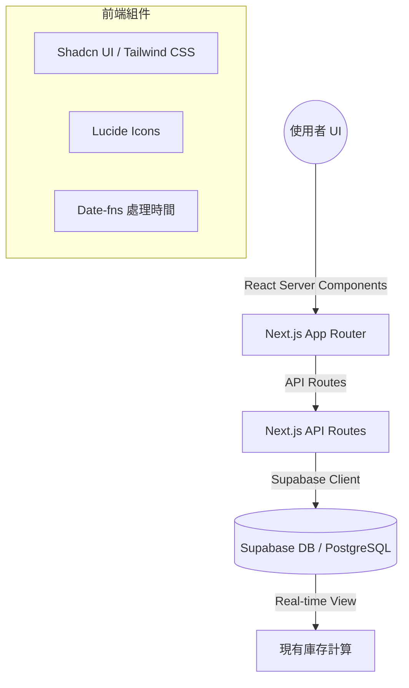

# 羽球庫存共享小幫手 (Shuttlecock Tracker)

🔗 **正式環境網址**：[https://shuttlecock-tracker.vercel.app/](https://shuttlecock-tracker.vercel.app/)

這是一個基於 **Next.js 15** 與 **Supabase** 打造的羽球庫存管理系統，旨在解決羽球團體中庫存統計與費用結算的痛點。

## 🚀 核心功能

- **即時庫存監控**：直觀顯示剩餘桶數，並在低庫存時自動發出報警提示。
- **領取登記流程**：快速登記領取人、數量與時間，支援即時歷史紀錄更新。
- **安全入庫管理**：具備密碼驗證（預設 `1111`）的入庫流程，支援二次確認以防止輸入錯誤。
- **智能數據結算**：可按領取人、時間區間與單價即時試算總領取桶數與應付金額。
- **歷史紀錄管理**：清楚記錄每一筆變動，並支援紀錄刪除與庫存連動更新。

## 🛠️ 技術架構

本專案採用現代化全棧架構，確保開發效率與運行穩定性：



- **框架**：Next.js 15 (App Router)
- **樣式**：Tailwind CSS 4 + Shadcn UI
- **資料庫**：Supabase (PostgreSQL)
- **部署**：Vercel
- **邏輯**：採用 PostgreSQL View (`inventory_summary`) 自動處理累加與相減邏輯，確保數據一致性。

## 📦 開發指南

### 1. 環境變數設定

請在專案根目錄建立 `.env.local` 並填入以下資訊：

```env
NEXT_PUBLIC_SUPABASE_URL=你的_SUPABASE_URL
NEXT_PUBLIC_SUPABASE_ANON_KEY=你的_SUPABASE_ANON_KEY
```

### 2. 資料庫初始化

請在 Supabase SQL Editor 中執行專案內的 `supabase-setup.sql` 檔案內容，以建立必要的 Table 與 View。

### 3. 本地啟動

```bash
npm install
npm run dev
```

## 🔐 安全說明

目前管理功能（如：入庫登記）採用簡單的密碼驗證 (`1111`)，建議在生產環境部署時修改 `app/api/inventory/restock/route.ts` 中的密碼驗證邏輯或改用 Supabase Auth。

---

© 2025 動資訊有限公司 Active Info Co., Ltd. All rights reserved.
