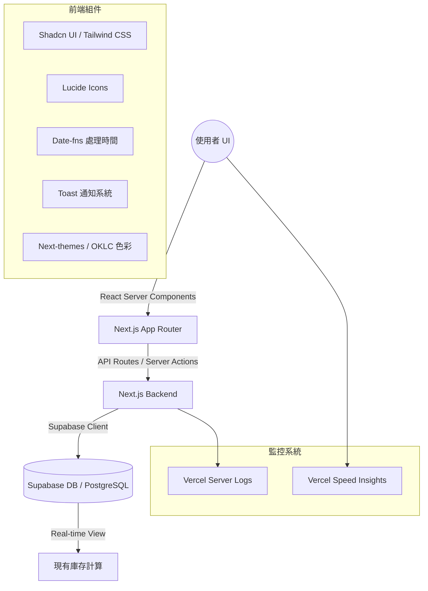

# 羽球庫存共享小幫手 (Shuttlecock Tracker)

🔗 **正式環境網址**：[https://shuttlecock-tracker.vercel.app/](https://shuttlecock-tracker.vercel.app/)

這是一個基於 **Next.js 15** 與 **Supabase** 打造的羽球庫存管理系統，旨在解決羽球團體中庫存統計與費用結算的痛點。

## 🚀 核心功能

### 基礎功能

- **即時庫存監控**：直觀顯示剩餘桶數，並在低庫存時自動發出報警提示。
- **領取登記流程**：快速登記領取人、數量與時間，支援即時歷史紀錄更新。
- **安全入庫管理**：具備密碼驗證（預設 `1111`）的入庫流程，支援二次確認以防止輸入錯誤。
- **球種管理**：支援多種球種設定，可針對不同球種進行庫存追蹤 (v1.2)。
- **智能數據結算**：可按領取人、時間區間與單價即時試算總領取桶數與應付金額。
- **歷史紀錄管理**：清楚記錄每一筆變動，並支援紀錄刪除與庫存連動更新。
- **團體設定管理**：支援修改球團名稱、聯絡信箱、系統登入密碼以及入庫管理密碼。

### 營運監控 (v1.2)

- **⚡ 效能監控 (Speed Insights)**：整合 Vercel Speed Insights，即時追蹤網站載入效能與使用者體驗指標。
- **📝 登入日誌 (Login Logs)**：
  - 自動記錄使用者登入與註冊行為。
  - 透過 Server Actions `[Login Success]` 將帳號與時間戳記寫入 Vercel Logs。
  - 方便管理員於後台追蹤系統使用狀況。

### 使用者體驗優化 (v1.1)

- **🎯 初始庫存設定流程**：
  - 新球團註冊時初始庫存為 0，引導使用者完成初始設定
  - **歡迎引導彈窗**：首次登入自動彈出，提供預設密碼提示 (`1111`) 與設定引導
  - **智慧防呆**：庫存為 0 時自動禁用領取功能
- **🌙 完整深色模式支援**：所有元件皆適配深色主題，提供舒適閱讀體驗。
- **📱 行動裝置優化**：Toast 通知系統、觸控友善設計與響應式排版。

## 🛠️ 技術架構

本專案採用現代化全棧架構，確保開發效率與運行穩定性：



- **框架**：Next.js 15 (App Router)
- **語言**：TypeScript
- **樣式**：Tailwind CSS 4 + Shadcn UI
- **資料庫**：Supabase (PostgreSQL)
- **認證**：Supabase Auth
- **部署**：Vercel

## 📦 開發指南

### 1. 環境變數設定

請在專案根目錄建立 `.env.local` 並填入以下資訊：

```env
NEXT_PUBLIC_SUPABASE_URL=你的_SUPABASE_URL
NEXT_PUBLIC_SUPABASE_ANON_KEY=你的_SUPABASE_ANON_KEY
```

### 2. 資料庫初始化

請在 Supabase SQL Editor 中執行專案內的 `supabase-setup.sql` 檔案內容，以建立必要的 Table、View 與 RLS Policies。

**資料庫結構重點：**

- `groups`, `profiles`: 多租戶架構基礎
- `pickup_records`, `restock_records`: 庫存核心紀錄 table
- `inventory_summary`: 自動庫存計算 View

### 3. 本地啟動

```bash
npm install
npm run dev
```

## 📝 更新日誌

### v1.2 (2026-01-13)

- ⚡ **新增**：整合 Vercel Speed Insights 效能監控。
- 📝 **新增**：實作 Server-side 登入日誌記錄 (`[Login Success]`)。
- ✨ **優化**：球種管理功能更新 (`shuttlecock-type-manager`)。

### v1.1 (2026-01-07)

- ✨ **新增**：初始庫存設定與歡迎引導流程。
- 🎨 **優化**：深色模式與行動裝置 UI 體驗。

### v1.0 (2025-12-30)

- 🎉 初始版本，包含基礎庫存管理、結算與歷史紀錄功能。

---

© 2025 動資訊有限公司 Active Info Co., Ltd. All rights reserved.
