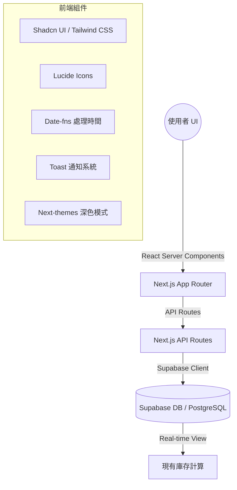

# 羽球庫存共享小幫手 (Shuttlecock Tracker)

🔗 **正式環境網址**：[https://shuttlecock-tracker.vercel.app/](https://shuttlecock-tracker.vercel.app/)

這是一個基於 **Next.js 15** 與 **Supabase** 打造的羽球庫存管理系統，旨在解決羽球團體中庫存統計與費用結算的痛點。

## 🚀 核心功能

### 基礎功能

- **即時庫存監控**：直觀顯示剩餘桶數，並在低庫存時自動發出報警提示。
- **領取登記流程**：快速登記領取人、數量與時間，支援即時歷史紀錄更新。
- **安全入庫管理**：具備密碼驗證（預設 `1111`）的入庫流程，支援二次確認以防止輸入錯誤。
- **智能數據結算**：可按領取人、時間區間與單價即時試算總領取桶數與應付金額。
- **歷史紀錄管理**：清楚記錄每一筆變動，並支援紀錄刪除與庫存連動更新。
- **團體設定管理**：支援修改球團名稱、聯絡信箱、系統登入密碼以及入庫管理密碼。

### 新增功能 (v1.1)

- **🎯 初始庫存設定流程**：
  - 新球團註冊時初始庫存為 0，引導使用者完成初始設定
  - **歡迎引導彈窗**：首次登入自動彈出，提供預設密碼提示 (`1111`) 與設定引導
  - **智慧防呆**：庫存為 0 時自動禁用領取登記，防止錯誤操作
  - **自動化流程**：點擊引導按鈕自動開啟入庫登記對話框
- **🌙 完整深色模式支援**：
  - 所有元件皆適配深色主題，提供舒適的視覺體驗
  - 使用 `oklch` 色彩空間與自訂 CSS 類別，確保漸層與光影效果一致且精緻
  - 支援系統主題自動切換
- **📱 行動裝置優化**：
  - **Toast 通知系統**：取代傳統 alert，提供非阻斷式的即時回饋
  - **觸控友善**：優化按鈕尺寸與互動區域，不依賴滑鼠 hover 效果
  - **響應式設計**：完美適配各種螢幕尺寸

## 🛠️ 技術架構

本專案採用現代化全棧架構，確保開發效率與運行穩定性：



- **框架**：Next.js 15 (App Router)
- **樣式**：Tailwind CSS 4 + Shadcn UI + 自訂 CSS 類別
- **資料庫**：Supabase (PostgreSQL)
- **認證**：Supabase Auth (Email/Password)
- **部署**：Vercel
- **邏輯**：採用 PostgreSQL View (`inventory_summary`) 自動處理累加與相減邏輯，確保數據一致性。

## 📦 開發指南

### 1. 環境變數設定

請在專案根目錄建立 `.env.local` 並填入以下資訊：

```env
NEXT_PUBLIC_SUPABASE_URL=你的_SUPABASE_URL
NEXT_PUBLIC_SUPABASE_ANON_KEY=你的_SUPABASE_ANON_KEY
```

### 2. 資料庫初始化

請在 Supabase SQL Editor 中執行專案內的 `supabase-setup.sql` 檔案內容，以建立必要的 Table、View 與 RLS Policies。

**資料庫結構重點：**

- `groups`: 儲存球團資訊
- `profiles`: 儲存使用者與球團的關聯
- `inventory_config`: 儲存入庫紀錄 (initial_quantity)
- `pickup_records`: 儲存領取紀錄
- `inventory_summary`: 計算當前庫存的 View

### 3. 本地啟動

```bash
npm install
npm run dev
```

預設開發埠為 `3001` (設定於 `package.json`)。

## 🎨 設計特色

### 深色模式 (Dark Mode)

- 使用 `next-themes` 進行切換
- 在 `globals.css` 中定義了基於 `oklch` 的自訂 CSS 類別 (如 `.welcome-guide-card`, `.toast-success`)
- 確保在切換主題時，漸層背景與邊框顏色能平滑過渡

### 使用者體驗 (UX)

- **首次使用體驗**：透過 Dialog 引導新用戶，降低學習曲線
- **視覺回饋**：重要操作 (如入庫) 加入脈衝動畫 (`pulse-highlight`) 吸引注意
- **錯誤處理**：驗證入庫密碼與庫存數量，並透過 Toast 顯示明確錯誤訊息

## 🔐 安全說明

- **資料隔離**：啟用 Row Level Security (RLS)，確保使用者只能存取自己所屬球團的資料。
- **入庫保護**：入庫登記採用獨立密碼驗證（預設 `1111`），可在「帳號設定」中修改，支援二次確認。
- **帳號管理**：支援修改球團名稱與聯絡信箱。

## 📝 更新日誌

### v1.1 (2026-01-07)

- ✨ **新增**：初始庫存設定流程，包含歡迎引導彈窗與自動觸發入庫
- ✨ **新增**：Toast 通知系統，優化操作回饋
- 🎨 **優化**：完整深色模式支援，自訂精緻 UI 樣式
- 📱 **優化**：行動裝置互動體驗，移除 hover 依賴
- 🔧 **修正**：庫存為 0 時自動禁用領取功能

### v1.0 (2025-12-30)

- 🎉 初始版本發布
- ✨ 基礎庫存管理功能 (監控、領取、入庫)
- ✨ 歷史紀錄管理與刪除
- ✨ 結算試算功能

---

© 2025 動資訊有限公司 Active Info Co., Ltd. All rights reserved.
