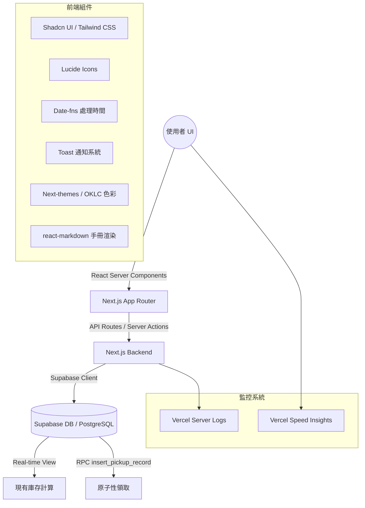

# 羽球庫存共享小幫手 (Shuttlecock Tracker)

🔗 **正式環境網址**：[https://shuttlecock-tracker.vercel.app/](https://shuttlecock-tracker.vercel.app/)

這是一個基於 **Next.js 15** 與 **Supabase** 打造的羽球庫存管理系統，旨在解決羽球團體中庫存統計與費用結算的痛點。

## 🚀 核心功能

### 基礎功能

- **即時庫存監控**：直觀顯示剩餘桶數，並在低庫存時自動發出報警提示。
- **領取登記流程**：快速登記領取人、數量與時間，支援即時歷史紀錄更新。
- **安全入庫管理**：具備密碼驗證（預設 `1111`）的入庫流程，支援二次確認以防止輸入錯誤。
- **球種管理**：支援多種球種設定，可針對不同球種進行庫存追蹤 (v1.2)。
- **智能數據結算**：可按領取人、時間區間與單價即時試算總領取桶數與應付金額（FIFO 計算）。
- **歷史紀錄管理**：清楚記錄每一筆變動，並支援紀錄刪除與庫存連動更新。
- **團體設定管理**：支援修改球團名稱、聯絡信箱、系統登入密碼以及入庫管理密碼。
- **📖 使用手冊**：內建使用手冊，可於主頁 Header 點擊書本圖示開啟查閱 (v1.3)。

### 安全與穩定性 (v1.3)

- **🔒 PIN 強化雜湊**：入庫密碼採用 PBKDF2（100k 次迭代、SHA-256）透過 Web Crypto API 進行雜湊，向下相容舊版純文字 PIN。
- **⚛️ 原子性領取操作**：透過 Supabase RPC `insert_pickup_record` 搭配 `SELECT ... FOR UPDATE` 鎖定，杜絕 TOCTOU 競態條件。
- **🛡️ 安全刪除群組**：刪除流程先移除 Auth User 再清除業務資料，確保失敗時能提前中止。

### 效能優化 (v1.3)

- **📊 查詢限制**：領取紀錄查詢加入 `.limit(100)`，補貨紀錄加入 `.limit(500)`，防止無界限全表掃描。
- **🗂️ 資料庫索引**：新增 5 個複合索引，覆蓋 `group_id`、`created_at`、`shuttlecock_type_id` 等高頻查詢欄位，大幅提升 FIFO 結算效能。

### 營運監控 (v1.2)

- **⚡ 效能監控 (Speed Insights)**：整合 Vercel Speed Insights，即時追蹤網站載入效能與使用者體驗指標。
- **📝 登入日誌 (Login Logs)**：
  - 自動記錄使用者登入與註冊行為。
  - 透過 Server Actions `[Login Success]` 將帳號與時間戳記寫入 Vercel Logs。
  - 方便管理員於後台追蹤系統使用狀況。

### 使用者體驗優化 (v1.1)

- **🎯 初始庫存設定流程**：
  - 新球團註冊時初始庫存為 0，引導使用者完成初始設定。
  - **歡迎引導彈窗**：首次登入自動彈出，提供預設密碼提示 (`1111`) 與設定引導。
  - **智慧防呆**：庫存為 0 時自動禁用領取功能。
- **🌙 完整深色模式支援**：所有元件皆適配深色主題，提供舒適閱讀體驗。
- **📱 行動裝置優化**：Toast 通知系統、觸控友善設計與響應式排版。

## 🛠️ 技術架構

本專案採用現代化全棧架構，確保開發效率與運行穩定性：


```mermaid
graph TD
    User((使用者 UI)) -- React Server Components --> Page[Next.js App Router]
    Page -- API Routes / Server Actions --> Backend[Next.js Backend]
    Backend -- Supabase Client --> Supabase[(Supabase DB / PostgreSQL)]
    Supabase -- Real-time View --> Inventory[現有庫存計算]
    Supabase -- RPC insert_pickup_record --> AtomicPickup[原子性領取]

    subgraph Monitoring [監控系統]
        VercelLog[Vercel Server Logs]
        SpeedInsights[Vercel Speed Insights]
    end

    Backend --> VercelLog
    User --> SpeedInsights

    subgraph Frontend [前端組件]
        UI1[Shadcn UI / Tailwind CSS]
        UI2[Lucide Icons]
        UI3[Date-fns 處理時間]
        UI4[Toast 通知系統]
        UI5[Next-themes / OKLC 色彩]
        UI6[react-markdown 手冊渲染]
    end
```

- **框架**：Next.js 15.1 (App Router)
- **語言**：TypeScript
- **樣式**：Tailwind CSS 4 + Shadcn UI
- **資料庫**：Supabase (PostgreSQL)
- **認證**：Supabase Auth
- **部署**：Vercel

## 📦 開發指南

> 詳細開發規範請參閱 [CLAUDE.md](./CLAUDE.md)。

### 1. 環境變數設定

請在專案根目錄建立 `.env.local` 並填入以下資訊：

```env
NEXT_PUBLIC_SUPABASE_URL=你的_SUPABASE_URL
NEXT_PUBLIC_SUPABASE_ANON_KEY=你的_SUPABASE_ANON_KEY
SUPABASE_SERVICE_ROLE_KEY=你的_SERVICE_ROLE_KEY   # 僅用於 DELETE /api/group
NEXT_PUBLIC_SITE_URL=你的_SITE_URL
```

### 2. 資料庫初始化

請在 Supabase SQL Editor 中執行 `supabase-migration.sql` 的完整內容，以建立必要的 Table、View、RPC Function 與 RLS Policies。

**資料庫結構重點：**

- `groups`, `profiles`：多租戶架構基礎
- `pickup_records`, `restock_records`：庫存核心紀錄 table
- `shuttlecock_types`：球種管理
- `inventory_summary`：自動庫存計算 View
- `insert_pickup_record()`：原子性領取 RPC（防止競態條件）

> **注意**：後續 Migration 僅需複製 `supabase-migration.sql` 末尾的新增區塊至 SQL Editor 執行，切勿重新執行整個檔案。

### 3. 本地啟動

```bash
npm install
npm run dev
```

## 📝 更新日誌

### v1.4 (2026-04-01)

- 🐛 **修正**：結算試算的結束日期邊界錯誤——`end_date` 原先被解析為 UTC 00:00，導致當天紀錄幾乎全數被排除；改用「加一天取嚴格小於」修正為涵蓋完整當天。

### v1.3 (2026-03-30)

- 📖 **新增**：內建使用手冊（`docs/user-manual.md`），可於主頁 Header 開啟查閱。
- 🔒 **安全**：入庫 PIN 改用 PBKDF2 雜湊（`lib/crypto.ts`），向下相容舊版明文 PIN。
- ⚛️ **安全**：領取操作改用 `insert_pickup_record` RPC，透過 `SELECT ... FOR UPDATE` 消除競態條件。
- 🛡️ **安全**：群組刪除流程加入 Auth-first 安全順序。
- 📊 **效能**：主要查詢加入限制筆數（100 / 500 筆），防止全表掃描。
- 🗂️ **效能**：新增 5 個資料庫索引，覆蓋高頻查詢欄位（`group_id`、`created_at`、`shuttlecock_type_id`）。
- 🔧 **重構**：抽出 `lib/supabase/helpers.ts` 共用 `getGroupId()` 工具函式。
- 🐛 **修正**：FIFO 結算邏輯計算錯誤。
- 🐛 **修正**：`lib/crypto.ts` 的 `Uint8Array` TypeScript 型別相容性問題。
- ✨ **優化**：入庫、結算、球種管理操作加入 Loading 狀態指示器。
- 📄 **文件**：新增 `CLAUDE.md` 開發規範與 Migration 策略文件。

### v1.2 (2026-01-13)

- ⚡ **新增**：整合 Vercel Speed Insights 效能監控。
- 📝 **新增**：實作 Server-side 登入日誌記錄 (`[Login Success]`)。
- ✨ **優化**：球種管理功能更新 (`shuttlecock-type-manager`)。

### v1.1 (2026-01-07)

- ✨ **新增**：初始庫存設定與歡迎引導流程。
- 🎨 **優化**：深色模式與行動裝置 UI 體驗。

### v1.0 (2025-12-30)

- 🎉 初始版本，包含基礎庫存管理、結算與歷史紀錄功能。

---

© 2025 動資訊有限公司 Active Info Co., Ltd. All rights reserved.
